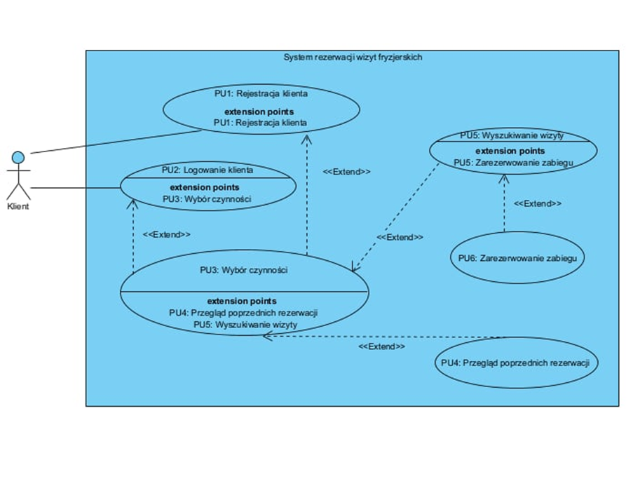

# System Rezerwacji Wizyt w Salonie Fryzjerskim

## Opis
Aplikacja bazodanowa do zarządzania rezerwacjami w salonie fryzjerskim. System przechowuje informacje o pracownikach (imię, nazwisko, nr telefonu, dostępne i zajęte terminy, specjalizacja, liczba lat doświadczenia) oraz o klientach (płeć, imię, nazwisko, poprzednie zabiegi, nr telefonu jako unikalny sposób identyfikacji). Klienci mają możliwość wyszukiwania dostępnych terminów i zabiegów na podstawie swoich preferencji, takich jak rodzaj zabiegu, fryzjer, czy data.

## Wymagania funkcjonalne
1. **Wyszukiwanie wolnych terminów** – System umożliwia wyszukiwanie wolnych terminów zabiegów przez klientów z uwzględnieniem pożądanych opcji (rodzaj zabiegu, fryzjer, data).
2. **Rejestracja i logowanie** – System umożliwia klientowi rejestrację i logowanie się do systemu.
3. **Rezerwacja wizyt** – Klient ma możliwość dokonania rezerwacji wizyty.
4. **Historia rezerwacji** – Klient może przeglądać historię swoich poprzednich rezerwacji.

## Wymagania niefunkcjonalne
1. **Blokowanie zarezerwowanych terminów** – System automatycznie blokuje terminy zarezerwowane przez jednego klienta, aby uniemożliwić ich ponowną rezerwację przez innych użytkowników.
2. **Unikalny numer telefonu** – Rejestracja klienta wymaga podania unikalnego numeru telefonu, który pełni rolę identyfikatora w systemie.
3. **Logowanie przed działaniami** – Klient może przystąpić do wyboru czynności wyłącznie po zalogowaniu się lub zarejestrowaniu w systemie. Bez spełnienia tego wymogu dostęp do dalszych działań jest zablokowany.
4. **Rezerwacja po wyszukaniu dostępnych terminów** – Rezerwacja zabiegu jest możliwa tylko po wyszukaniu dostępnych terminów wizyty. Użytkownik musi najpierw sprawdzić dostępne sloty czasowe, aby zapobiec kolizji terminów.

## Diagram przypadków uzycia

## Identyfikacja encji

### Clients
Reprezentuje osobę, która korzysta z systemu, aby zarezerwować wizytę.

**Atrybuty:**
- `client_id` – unikalny identyfikator klienta (klucz główny)
- `first_name` – imię klienta
- `last_name` – nazwisko klienta
- `email` – adres e-mail klienta (unikalny, do komunikacji i logowania)
- `telephone_nr` – numer telefonu klienta (unikalny, opcjonalnie do komunikacji SMS)
- `password` – zaszyfrowane hasło do logowania

### Hairdressers
Reprezentuje fryzjera, który świadczy usługi w salonie.

**Atrybuty:**
- `hairdresser_id` – unikalny identyfikator fryzjera (klucz główny)
- `first_name` – imię fryzjera
- `last_name` – nazwisko fryzjera
- `specialization` – specjalizacja fryzjera (np. strzyżenie, koloryzacja)
- `telephone_nr` – numer telefonu fryzjera
- `years_experience` – liczba lat doświadczenia

### Visits
Reprezentuje rezerwację wizyty przez klienta na określony termin.

**Atrybuty:**
- `visit_id` – unikalny identyfikator wizyty (klucz główny)
- `visit_date` – data wizyty
- `visit_time` – godzina wizyty
- `client_id` – identyfikator klienta, który zarezerwował wizytę (klucz obcy do tabeli Klient)
- `hairdresser_id` – identyfikator fryzjera wykonującego usługę (klucz obcy do tabeli Fryzjer)
- `service_id` – identyfikator usługi (klucz obcy do tabeli Usługa)
- `status` – status wizyty (np. zaplanowana, odwołana)
- `price` – cena usługi

### Services
Reprezentuje różne usługi oferowane przez salon fryzjerski.

**Atrybuty:**
- `service_id` – unikalny identyfikator usługi (klucz główny)
- `service_name` – nazwa usługi (np. Strzyżenie, Koloryzacja)
- `description` – krótki opis usługi
- `price` – cena za usługę
- `duration` – przewidywany czas trwania usługi (np. 30 minut, 1 godzina)

---

## Wymagania dotyczące dostępu do bazy i jej zawartości

Poniżej przedstawiono wymagania dotyczące dostępu do bazy danych i jej zawartości z perspektywy klienta.

| Tabela    | Działania                                                                 |
|-----------|---------------------------------------------------------------------------|
| **Klient** | - Może wstawiać swoje dane przy rejestracji.                             |
|           | - Może wyszukiwać swoje wcześniejsze wizyty.                             |
| **Wizyta** | - Może wstawiać nowe wizyty (rezerwacje).                                |
|           | - Może modyfikować swoje wizyty (np. zmiana terminu lub odwołanie wizyty).|
|           | - Może wyszukiwać swoje wcześniejsze wizyty.                             |
| **Usługa** | - Może wyszukiwać dostępne usługi (np. przegląd cennika i czasu trwania).|
